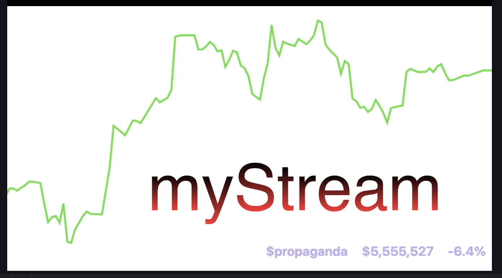

# Stream Tools

A collection of customizable web widgets for live streaming overlays.

## Current Price Widget

A real-time cryptocurrency price tracker designed for OBS Browser Sources. Displays token symbol, market cap, and 24-hour percentage change with auto-refresh every 5 seconds.

### Why Use This?

- **Customizable**: Adjust font size, colors, transparency, and coin tracking via a simple settings interface
- **OBS-Ready**: Works as a Browser Source in OBS with transparent backgrounds
- **Live Updates**: Automatically fetches and displays real-time market data
- **Shareable**: Generate custom widget URLs to reuse across streams or share with others

### How to Use

#### 1. Configure Your Widget

1. Open `current-price.html` in your browser
2. The settings modal will appear automatically on first load
3. Customize your widget:
   - **Font Size**: Adjust text size in pixels
   - **Foreground Color**: Set the text color
   - **Background Color**: Choose background color
   - **Background Opacity**: Control transparency (0-100%)
   - **Coin Address**: Enter the token contract address to track
   - **Chain ID**: Specify the blockchain network (e.g., 8453 for Base)
4. Click **"Copy Widget URL"** to copy the configured URL
5. Click **"Preview"** to see your widget in action

#### 2. Add to OBS

1. In OBS, click **"+"** in the Sources panel
2. Select **"Browser"**
3. Give it a name (e.g., "Crypto Price Ticker")
4. Paste your copied widget URL into the **URL** field
5. Set dimensions:
   - Width: 1920 (or your stream width)
   - Height: 200 (adjust as needed)
6. Check **"Shutdown source when not visible"** (optional, saves resources)
7. Click **OK**

#### 3. Position and Style

- Drag the browser source to position it on your stream
- Resize using the red bounding box handles
- Click anywhere on the widget in your browser to reopen settings and adjust colors/transparency
- Use background opacity at 0% for a fully transparent background in OBS

### Technical Details

- **Data Source**: Zora API (https://api-sdk.zora.engineering)
- **Update Frequency**: Every 5 seconds
- **Default Token**: $propaganda on Base (Chain ID: 8453)

### Tips

- For transparent overlays, set Background Opacity to 0%
- Test your widget in a browser before adding to OBS
- Save multiple widget URLs for different coins
- Click anywhere on the widget to edit settings on the fly
